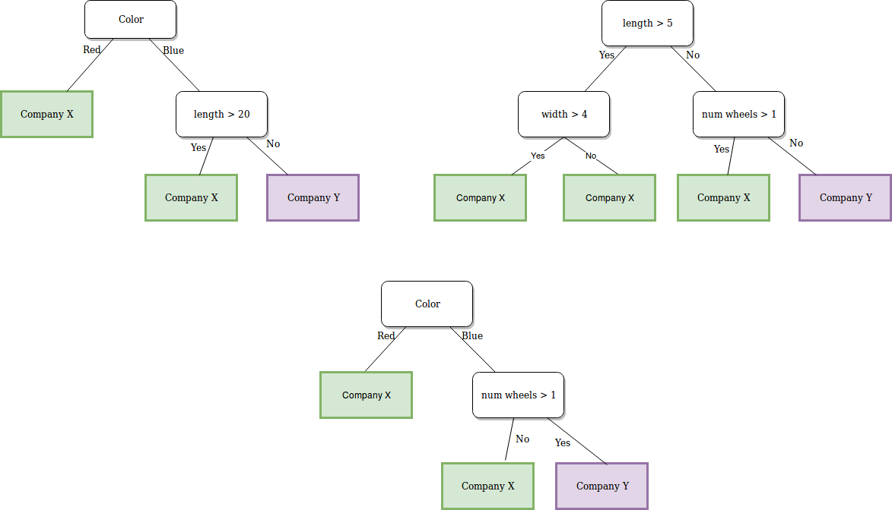

\ \ 

A couple of friends have nothing to do on a Saturday afternoon and decide to build a random forest to predict which of two companies manufactures different unicycles, bicycles, and tricycles that they own.  When creating the forest, the 3 above trees are created (ntree = 3). The predictors in their data are color, length, width, and num wheels.

1. What are the possible values of d (the number of candidate variables at each split)?

&nbsp;&nbsp;

2. Which predictor is probably is the most important, as judged by the gini-index?

&nbsp;&nbsp;

3. If we have a blue pedaled vehicle that is 30 units long, 6 units wide, and has 2 wheels, which company will the random forest predict constructed the vehicle?

&nbsp;

4. Why is a smaller value of d often better?

&nbsp;
