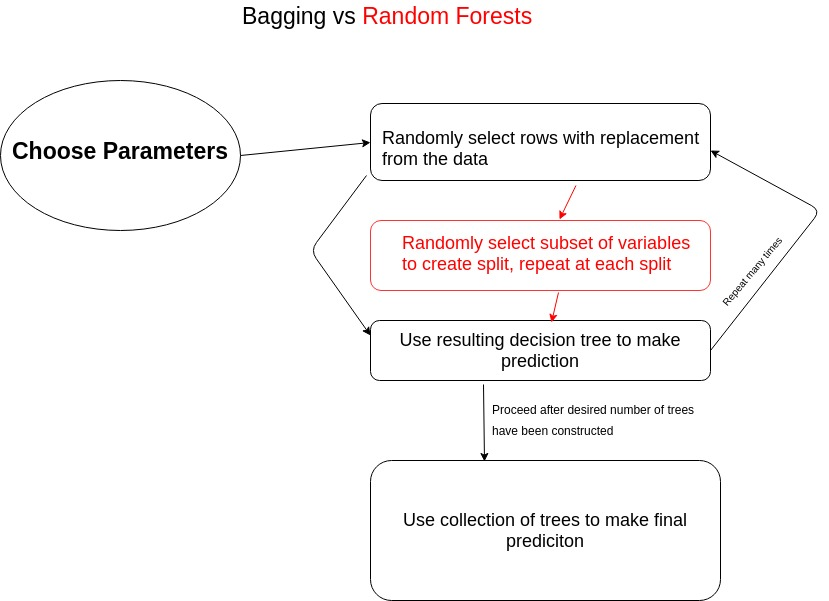
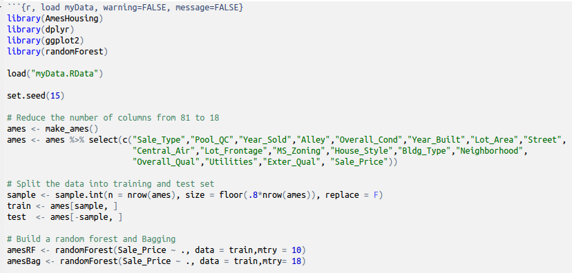

```{r setup, include=FALSE}
knitr::opts_chunk$set(echo = FALSE)
library(AmesHousing)
library(dplyr)
library(ggplot2)
library(randomForest)

Sys.setenv(PATH = paste(Sys.getenv("PATH"), "C:\\Users\\Travers\\AppData\\Local\\Programs\\MiKTeX 2.9\\miktex\\bin\\x64", sep=.Platform$path.sep))
```

# Random Forests vs. Bagging (Motivation)

### The Difference
The process of creating a random forest is very similar to the process of bagging with one small caveat. In a random forest every time a split is considered a random sample of *m* predictors from the total *p* predictors are chosen as candidates for the split. Bagging is a special case of Random Forests when *m* = *p*. 

### Why?

**Decorrelation**: The weakness of bagging is that many trees end up looking the same because they will almost always use the strongest predictors in the same order. Random Forests *decorrelate* trees and thus reduce the variance of the prediction. 

***
# Visualization



***
# Algorithm

### Parameters

  1. Number of trees, *k*
  2. Number of variables to select randomly at each split, *m*
  3. (optional) Size of training set, the rows that we sample from without replacement
  4. (optional) Maximum size of the trees grown, by number of nodes *j*

### Construction

> 1. Randomly select rows with replacement from data (typically use 2/3's of rows) 
> 2. **Randomly select** ***m* variables to create split** (typically $m \equiv \sqrt{p}$)
> 3. Repeat step 2 at each split until decision tree is built
> 4. Use resulting decision tree to make prediction
> 5. Repeat steps 1-3 *k* times

<!-- Any questions?  -->

***

### Example in R (Ames Housing)

We will use a random forest to predict the sale price of a house is the Ames Housing dataset. 
```{r,eval=FALSE,echo = TRUE}
# We will use the randomForest library
library(randomForest)

# Use a selection of variables
rf <- randomForest(Sales_Price ~ Year_Sold + Alley 
                   + Year_Built, data = ames)

# Use all variables
rf <- randomForest(Sales_Price ~ ., data = ames)
```

- We will use the randomForest library in R to construct our randomForests
- Simply provide the constructor with a formula and the dataset to be used

***

# Variable Selection

```{r , echo=FALSE,fig.height= 10}
knitr::include_graphics("images/icrop_1.png")
```

***

```{r, warning=FALSE, message=FALSE,echo = FALSE}

library(readr)

### ====================
# Commented because running script is very 
# computationally expensive
### ====================

# oob.err=double(18)
# test.err=double(18)
# 
# # Try building a random forest for every value of mtry
# for(mtry in 1:18)
# {
#   rf= randomForest(Sale_Price ~ ., data = train,mtry = mtry)
#   oob.err[mtry] = rf$mse[400] #Error of all Trees fitted
# 
#   pred<-predict(rf,test) #Predictions on Test Set for each Tree
#   test.err[mtry]= with(test, mean( (Sale_Price - pred)^2)) #Mean Squared Test Error
# 
#   cat(mtry," ") #printing the output to the console
# 
# }
# errFrame = data.frame(numVars = 1:18,mseTest = test.err,mseOob = oob.err)
# write.csv(errFrame,"error_by_split.csv")

errFrame <- read_csv("data/error_by_split.csv") %>% select(-X1)

errFrame <- reshape2::melt(errFrame,id = 'numVars')
                           
ggplot(aes(x = numVars,y = value,color = variable),data = errFrame) + geom_line() + labs(x = "Number of Variables Considered at Each Split",y= "Mean Squared Error", title = " MSE By Variables Considered", color = "Type of Error")
```

*** 
# Creating the Random Forest

```{r ,echo=FALSE,fig.height= 10}

```

***
```{r, load myData, warning=FALSE, message=FALSE}
load("data/myData.RData")

set.seed(15)

# # Reduce the number of columns from 81 to 18
# ames <- make_ames()
# # ames <- ames %>% select(c("Sale_Type","Pool_QC","Year_Sold","Alley","Overall_Cond","Year_Built","Lot_Area","Street",
# #                          "Central_Air","Lot_Frontage","MS_Zoning","House_Style","Bldg_Type","Neighborhood",
# #                          "Overall_Qual","Utilities","Exter_Qual", "Sale_Price"))
# 
# # Split the data into training and test set
# sample <- sample.int(n = nrow(ames), size = floor(.8*nrow(ames)), replace = F)
# train <- ames[sample, ]
# test  <- ames[-sample, ]
# 
# # Build a random forest and Bagging
# amesRF <- randomForest(Sale_Price ~ ., data = train,mtry = 26)
# amesBag <- randomForest(Sale_Price ~ ., data = train,mtry= 81)

# Plot Mean-Squared Error of RF vs Bagging
err = data.frame(tree = 1:500,'Random Forest' = amesRF$mse, 'Bagging' = amesBag$mse)
gr = reshape2::melt(err,id = 'tree')

ggplot(data = gr,aes(tree,value,color = variable)) + geom_line() + labs(x = "Number of Trees",y = "Mean Squared Error"
                                                                        , title = "Mean Squared Error by Number of Trees", 
                                                                        color = "Method")
```


***

# Boosting

Boosting differs from Random Forests in that instead of growing many *decorrelated* trees, we build trees sequentially using information from previous trees. 

### Main Idea

Fit the first tree using the actual outcomes. Then from there on out use residuals from previous tree to fit next tree. 

# Algorithm

### Parameters

1. *B*, the number of trees to build. Unlike random forests there is a risk of overfitting the model if $B$ is too high. Use cross-validation to find optimal value of *B*.

2. *$\lambda$*, the shrinkage factor (typically 0.01 or 0.0001). The shrinkage factor determines how much the residuals from the current decision tree change the overall model. 

3. *d*, the number of splits in each tree. When *d* = 1, each tree is called a *stump*. 

***

### Construction

Let $\hat{f}$ be our function with which we will make regression estimates. 

> 1. Let $\hat{f}(x) = 0$ and $r_i = y_i$ for all $i$.

> 2. For $b \in \{1,2,\dots,B\}$, repeat:
    (a) Fit a tree *t_b* with *d* splits to the training data (X and r=y).
    (b) Update $\hat{f}(x)$ by adding weighted version of new tree: $$\hat{f}(x) = \hat{f}(x) + \lambda t_b(x). $$
    (c) Update the residuals *r*:
        $$r_i = r_i - \lambda t_b(x_i).$$

> 3. Return the final model:
$$\hat{f}(x) = \sum_{b=1}^B \lambda t_b(x)$$

***
# Example in R

For boosting, we will use the *gbm* package. Once again we will use the Ames Housing Data. 

```{r,echo = TRUE,message=FALSE,warning=FALSE}
library(gbm)
set.seed(1)
# Create our boosting model
amesBoost <- gbm(Sale_Price ~ .,data = ames,train.fraction = .8, 
                 distribution = 'gaussian',
                 n.trees = 500,interaction.depth = 3)
```
- *train.fraction* determines the fraction of data to be used for training and the fraction to be used for validation
- *distribution*, typically *gaussian* if outcome variable is continuous and *bernoulli* for binary outcome
- *n.trees*, number of trees to train model on
- *interaction.depth*, maximum number of splits allowed in each tree

***

```{r,message=FALSE,warning=FALSE}
err <- err %>% mutate('Boosting' = amesBoost$valid.error)

gr = reshape2::melt(err,id = 'tree')

ggplot(data = gr,aes(tree,value,color = variable)) + geom_line() + labs(x = "Number of Trees",y = "Mean Squared Error"
                                                                        , title = "Mean Squared Error by Number of Trees", 
                                                                        color = "Method")
```


*** 

# Random Forests vs Boosting

## Random Forests

### Strengths
- low variance
- good with high dimensional data and missing data
- less likely to over-fit
- easy to tune hyperparameters

### Weaknesses
- can be slow
- can be biased (in terms of importance) towards categories with more levels
- larger trees can lack interpretibility

***

## Boosting

### Strengths
- fast
- smaller trees often are more intuitive
- low bias

### Weaknesses
- prone to overfitting
- harder to tune hyperparameters than for random forests

# Problem Set

1. MSDR Exercise 8.1 - but fit a model using both Boosting and Random Forests and compare the results visually. See my code from the presentation for reference (Pg 202-203). 

2. (conceptual) ISLR Exercises 8.4 - 1 (Pg 332)
