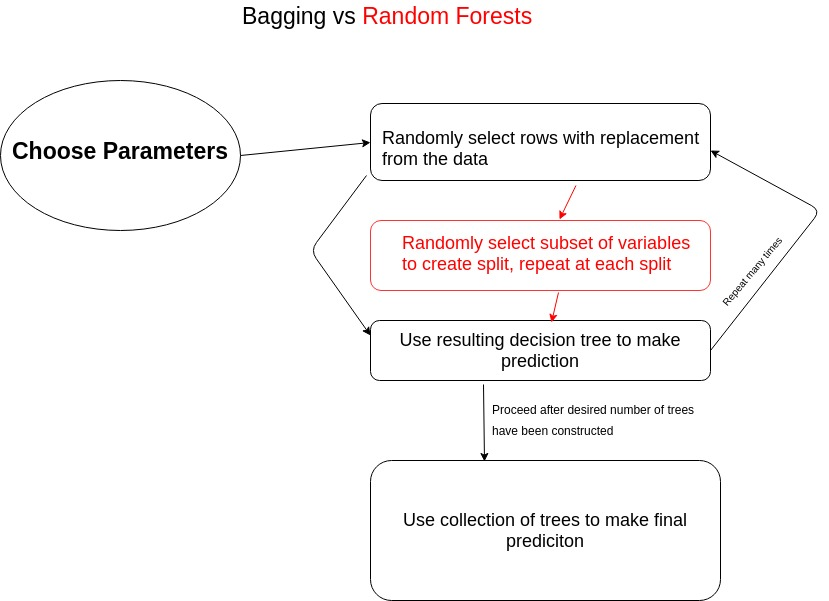

```{r setup, include=FALSE}
knitr::opts_chunk$set(echo = FALSE)
```

# Random Forests vs. Bagging (Motivation)

### The Difference
The process of creating a random forest is very similar to the process of bagging with one small caveat. In a random forest every time a split is considered a random sample of *m* predictors from the total *p* predictors are chosen as candidates for the split. Bagging is a special case of Random Forests when *m* = *p*. 

### Why?

**Decorrelation**: The weakness of bagging is that many trees end up looking the same because they will almost always use the strongest predictors in the same order. Random Forests *decorrelate* trees and thus reduce the variance of the prediction. 

***
# Visualization



***
# Construction of a Random Forest

### Parameters

  1. Number of trees, *k*
  2. Number of variables to select randomly at each split, *m*
  3. (optional) Size of training set, the rows that we sample from without replacement
  4. (optional) Maximum size of the trees grown, by number of nodes *j*

### Process

> 1. Randomly select rows with replacement from data (typically use 2/3's of rows) 
> 2. **Randomly select** ***m* variables to create split** (typically $m \equiv \sqrt{p}$)
> 3. Repeat step 2 at each split until decision tree is built
> 4. Use resulting decision tree to make prediction
> 5. Repeat steps 1-3 *k* times

<!-- Any questions?  -->

***

### Example in R (Ames Housing)

```{r}
library(AmesHousing)

ames <- make_ames()

```


